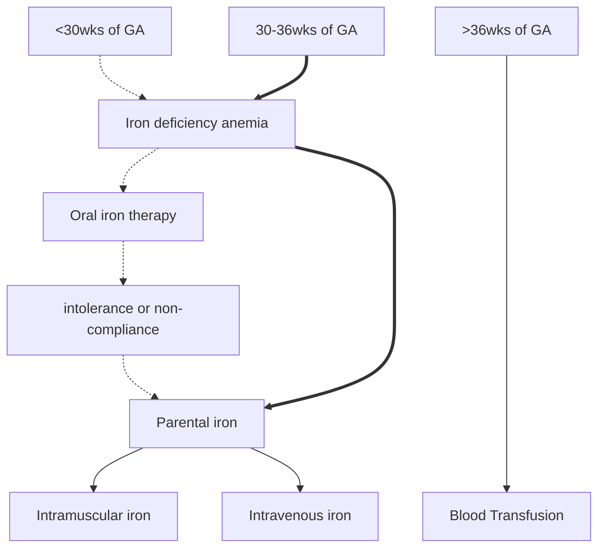

### Index
- Previous chapter -->
- Next Chapter[^1] -->
- Sources -
	- 
- 
# Anemia

## Anemia in Pregnancy
#definition/WHO --> Hb < 11% or Hematocrit <33%
#definition/FOGSI --> Hb cutoff of 10 g/dL for India, practically we take 11
- #Classification/ICMR *put a mermaid flow chart/ progress bar to show classification*
	- Mild degree --> 10-10.9 gm%
	- Moderate degree --> 7-10 gm%
	- severe < 7
	- very severe <4

#### Management of IDA in pregnancy

> Dose of *parenteral* iron = { *body weight (kg) x Hb deficit (g/dl) x 2.2* } + 1000mg (to replenish store)
> - Hb Deficit = Target Hb(14) - Serum Hb
> - Assumptions
> 	- Normal Hb is taken as 14 g/dL
> 	- Blood volume of 🤰 is 65ml/kg
> 	- ? Each gm of Hb --> 3.3mg of iron

#
[^1]: Next Chapter is 